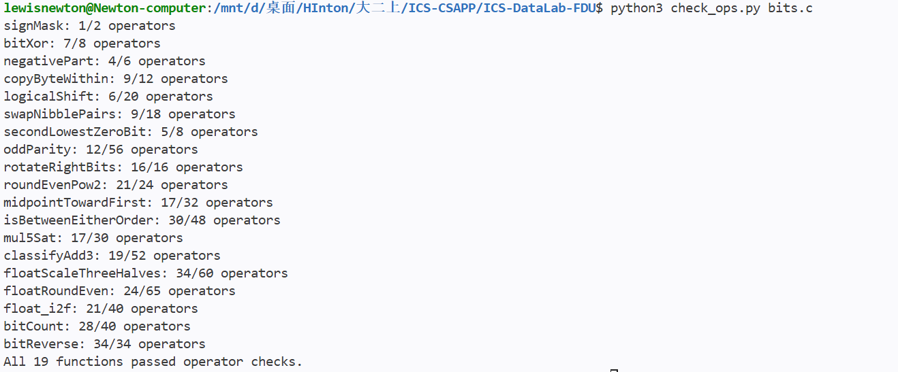
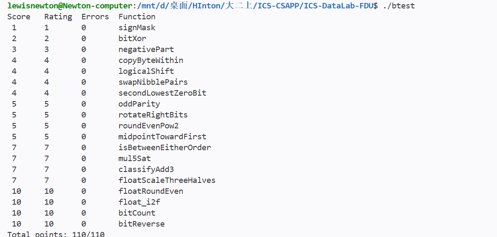

# Data Lab 实验报告

姓名：郭晟  
学号：25803050353  
实验名称：Lab 1 Data Lab  
实验日期：2026 年 10 月 9 日

## 一、实验目的与计算模型

本次实验需要完成 `bits.c` 中的 19 个函数。整数部分主要处理补码、掩码、移位和溢出，浮点部分则要求直接操作 IEEE 754 单精度编码，实现数值缩放、舍入和类型转换。

整数题按实验规定的 32 位位向量模型计算：`int` 使用二进制补码，右移为算术右移，加法和左移只保留低 32 位，移位量必须在 0 到 31 之间。除 `bitXor` 只能使用 `~` 和 `&` 外，其余整数题只能使用规定的小常量和 `! ~ & ^ | + << >>`，不能使用分支、循环或比较运算符。浮点题可以使用整数运算和控制流，但仍然不能使用浮点类型、浮点运算或类型转换。

下文用 `INT_MIN` 和 `INT_MAX` 表示 −2³¹ 和 2³¹−1。说明原理时会使用减法、乘法和比较，实际代码仍遵守题目的运算符限制。另外，有符号溢出、左移进入符号位等操作都按本实验模型解释；在普通 C 程序中使用这些写法，需要另外考虑语言规则。

## 二、实验环境与测试结果

实验在 Windows 的 WSL Ubuntu 环境下验证，使用仓库自带的 `Makefile`、`check_ops.py`、`dlc` 和 `btest`，编译选项为 `-O -Wall -fwrapv -m32`。

测试前先强制重新编译，避免运行旧的可执行文件，再检查编码规则和函数结果：

```bash
make -B all
python3 ./check_ops.py bits.c
./btest
```

### 2.1 运算符与操作数检查

下面是规则检查的终端截图。这里用 `python3 check_ops.py bits.c` 调用脚本，与要求中的 `./check_ops.py bits.c` 使用的是同一个检查器。



检查结果为：

```text
All 19 functions passed operator checks.
```

各函数的操作数统计如下，均未超过题目限制：

| 题号 | 函数 | 实际操作数 / 上限 |
|---|---|---:|
| P1 | `signMask` | 1 / 2 |
| P2 | `bitXor` | 7 / 8 |
| P3 | `negativePart` | 4 / 6 |
| P4 | `copyByteWithin` | 9 / 12 |
| P5 | `logicalShift` | 6 / 20 |
| P6 | `swapNibblePairs` | 9 / 18 |
| P7 | `secondLowestZeroBit` | 5 / 8 |
| P8 | `oddParity` | 12 / 56 |
| P9 | `rotateRightBits` | 16 / 16 |
| P10 | `roundEvenPow2` | 21 / 24 |
| P11 | `midpointTowardFirst` | 17 / 32 |
| P12 | `isBetweenEitherOrder` | 30 / 48 |
| P13 | `mul5Sat` | 17 / 30 |
| P14 | `classifyAdd3` | 19 / 52 |
| P15 | `floatScaleThreeHalves` | 34 / 60 |
| P16 | `floatRoundEven` | 24 / 65 |
| P17 | `float_i2f` | 21 / 40 |
| P18 | `bitCount` | 28 / 40 |
| P19 | `bitReverse` | 34 / 34 |

### 2.2 正确性测试

下图为终端执行 `./btest` 后的截图：



19 个函数的 `Errors` 均为 0，总得分为：

```text
Total points: 110/110
```

重新编译后的结果与截图一致。规则检查和 `btest` 分别检查代码是否符合限制、输出是否符合参考行为。本次两项检查都已通过；`btest` 的通过范围是它实际执行的测试，并不代表已经穷举所有输入。

## 三、各函数的实现思路

### P1：`signMask`

这一题只需要把 `1` 移到 32 位整数的最高位：

```c
1 << 31
```

得到的位模式是 `0x80000000`，其补码整数值为 `INT_MIN`。

### P2：`bitXor`

异或在两个对应位不同时取 1。我将这个条件拆为：至少有一个位为 1，同时排除两个位都是 1 的情况。

```c
atleastone = ~((~x) & (~y));
Bothone = x & y;
return atleastone & (~Bothone);
```

根据德摩根律，`~((~x) & (~y))` 等价于 `x | y`。再与 `~(x & y)` 相与，就得到异或结果，代码中只需要 `~` 和 `&`。

### P3：`negativePart`

补码取负可写为 `~x + 1`。利用算术右移，`x >> 31` 在 `x < 0` 时为全 1，在 `x >= 0` 时为全 0，因此：

```c
(~x + 1) & (x >> 31)
```

这样，负数对应的掩码保留取负结果，非负数对应的掩码将结果清零。`INT_MIN` 是一个例外：它的数学相反数是 2³¹，超出了有符号 32 位整数的范围，所以按实验模型取负后仍然得到 `0x80000000`。

### P4：`copyByteWithin`

字节编号从最低字节 0 到最高字节 3，每个字节占 8 位，所以用 `src << 3`、`dst << 3` 算出位偏移。先取出源字节，再清空目标位置，最后把源字节放进去：

```c
byte = (x >> srcShift) & 0xFF;
mask = 0xFF << dstShift;
return (x & ~mask) | (byte << dstShift);
```

提取时加上 `& 0xFF`，只留下需要的 8 位，也排除了算术右移补入的符号位。目标字节之外的位置不受影响。因为源字节已经提前保存，`src == dst` 时也能正确返回原值。

### P5：`logicalShift`

算术右移会在负数的高位补 1，而逻辑右移需要补 0。因此先计算 `x >> n`，再用低 `32-n` 位为 1 的掩码清除补入的符号位：

```c
mask = ~(((1 << 31) >> n) << 1);
return (x >> n) & mask;
```

构造掩码时，`(1 << 31) >> n` 的高 `n+1` 位为 1，左移一位后只留下高 `n` 位的 1，再取反即可。这里也需要照顾两个边界：`n == 0` 时掩码为全 1，原数不变；`n == 31` 时掩码为 `1`，只保留最后一位。整个过程中没有移位 32 位的操作。

### P6：`swapNibblePairs`

每个字节可以分成高、低两个 4 位的半字节（nibble）。先把 `0x0F` 扩展为 `0x0F0F0F0F`，用它一次选出四个字节的低半字节，再分别移动高、低两部分：

```c
((x & mask) << 4) | ((x >> 4) & mask)
```

左边将低 4 位移到高 4 位，右边将高 4 位移到低 4 位，按位或后就完成了交换。右边的掩码会去掉符号扩展和其他无关位，防止它们混入结果。

### P7：`secondLowestZeroBit`

这一题利用加 1 时的进位规律：只要原数不是全 1，加 1 就会把末尾连续的 1 清零，再把遇到的第一个 0 变成 1。将结果与原数按位或，清掉的 1 会被恢复，于是只有最低的那个 0 被填上：

```c
filled = x | (x + 1);
return ~filled & (filled + 1);
```

接下来，`~filled & (filled + 1)` 就能取出 `filled` 中最低的 0，也就是原数中第二低的 0。原来不足两个 0 时，`filled` 为全 1，结果自然为 0。例如 `0xFFFFFFFA` 的两个最低 0 位在第 0 位和第 2 位，所以返回 `0x4`。

### P8：`oddParity`

不必先数出所有的 1，只要把各位异或起来，就能知道 1 的个数是奇数还是偶数。代码按 16、8、4、2、1 位的距离逐步折叠：

```c
y = x ^ (x >> 16);
z = y ^ (y >> 8);
f = z ^ (z >> 4);
g = f ^ (f >> 2);
p = g ^ (g >> 1);
return !(p & 1);
```

最后，`p` 的最低位保存了原来 32 位的异或结果，算术右移补入的符号位不会影响这个位置。本题求的是奇校验位，所以原数中 1 的个数为偶数时还需要补一个 1，为奇数时则补 0。因此最后返回 `!(p & 1)`。

### P9：`rotateRightBits`

循环右移超过 32 位后会重复，所以先用 `k = n & 31` 将位数限制到 0 到 31。随后把结果分成两部分：高 `32-k` 位正常右移，低 `k` 位绕回最高端。

```c
tail = (x >> k) & ~(((1 << 31) >> k) << 1);
head = (x & ~(~0 << k)) << ((~k + 1) & 31);
return tail | head;
```

`tail` 沿用 P5 的逻辑右移方法，`head` 则先取出低 `k` 位，再移到高位。左移量写成 `(~k + 1) & 31`，即 `(-k) mod 32`，是为了处理 `k == 0`：此时 `head` 为 0，移位量也是 0。如果直接使用 `32-k`，就会出现不允许的移位 32 位。

### P10：`roundEvenPow2`

将输入分解为 `x = q × 2ⁿ + r`，其中 `q = x >> n`，`r` 是低 `n` 位。舍入到最近的 2ⁿ 倍数，只需判断是否将商 `q` 加 1：余数小于半程时不进位，大于半程时进位，等于半程时让最终商为偶数。

代码用保护位（guard bit）和粘滞位（sticky bit）区分这几种情况：

```c
half = 1 << (n + ~0);
guard = !!(r & half);
sticky = !!(r & (half + ~0));
inc = guard & (sticky | (q & 1));
return (q + inc) << n;
```

`guard` 表示余数是否达到半程，`sticky` 表示半程位以下是否还有非零位。两者都为 1 时超过半程，需要进位；`guard` 为 1 而 `sticky` 为 0 时恰好处于中点，要看 `q` 是否为奇数。这就是最近偶数舍入（round to nearest, ties to even）。例如，`10` 舍入到 4 的倍数时选 `8`，`14` 则选 `16`，因为对应的商 `2` 和 `4` 都是偶数。

### P11：`midpointTowardFirst`

直接计算 `(x + y) / 2` 的问题是：中点本身可能在范围内，但 `x + y` 已经溢出了。这里改用恒等式：

```text
x + y = 2 × (x & y) + (x ^ y)
```

可以先计算向下取整的中点：

```c
(x & y) + ((x ^ y) >> 1)
```

算术右移对负的奇数也向下取整，所以这个式子统一得到中点的下界，而且结果始终在两个输入之间。如果 `x + y` 为奇数，还需要按题意向第一个参数靠近：`x > y` 时加 1，否则保留当前结果。

判断 `x > y` 时也要避免溢出。两数异号，可以直接看 `y` 是否为负；两数同号，才使用 `y - x` 的符号，因为此时差值一定可表示。最后用下面的表达式决定是否加 1：

```c
(differentBits & xGreater & 1)
```

其中 `differentBits = x ^ y` 的最低位表示和是否为奇数，`xGreater` 表示是否需要向上调整。例如 `(4, 7)` 得到 `5`，交换参数后，`(7, 4)` 就得到 `6`。

### P12：`isBetweenEitherOrder`

不必先判断 `a`、`b` 谁大谁小。分别求出 `x < a` 和 `x < b` 的掩码，就可以判断 `x` 在端点的哪一侧。比较方法与 P11 相同：异号时看 `x` 的符号，同号时才看差值的符号。

如果 `x` 严格在两个端点之间，它只会小于其中一个端点，两个比较结果不同；如果在区间外，结果就相同。再补上等于端点的情况，就得到闭区间判断：

```c
!!(belowA ^ belowB) | !(x ^ a) | !(x ^ b)
```

该判断与 `a`、`b` 的顺序无关，`a == b` 时也只有 `x == a` 才返回 1。

### P13：`mul5Sat`

先用加法计算 `2x`，再得到 `4x`，最后加上 `x` 得到 `5x`，每一步只保留低 32 位。溢出判断不能只看最终结果：连续回绕后，结果的符号可能与原数相同。因此代码把每一步的符号变化都记录下来：

```c
overflow = ((x ^ twice) | (twice ^ four) | (four ^ five)) >> 31;
```

如果第一次或第二次倍增发生符号变化，说明数学意义上的 `2x` 或 `4x` 已越界，那么同方向且绝对值更大的 `5x` 必然越界。若前两步没有越界，`four` 与 `x` 同号，最后一次加法是否越界由 `four` 与 `five` 的符号变化确定。因此该掩码能判断精确的 `5x` 是否可表示。

饱和值通过原输入符号选择：

```c
limit = (1 << 31) ^ ~(x >> 31);
return (overflow & limit) | (~overflow & five);
```

正向溢出返回 `INT_MAX`，负向溢出返回 `INT_MIN`，未溢出则返回乘法结果。

### P14：`classifyAdd3`

这里要判断的是最终的数学和，而不是某次中间加法。例如 `INT_MAX + 1 + (-1)` 在第一步已经溢出，但精确的最终结果仍是 `INT_MAX`，应返回 0。

代码先计算 `sum = x + y`、`total = sum + z`。对一次有符号加法 `a + b = r`，溢出条件是输入同号且结果异号，可表示为：

```c
(~(a ^ b) & (a ^ r)) >> 31
```

为保留中间溢出的信息，每次加法都记录一个修正系数 `c`：正向溢出记 `+1`，负向溢出记 `-1`，未溢出记 `0`。将回绕后的结果解释为有符号数，就有：

```text
x + y + z = total + (c₁ + c₂) × 2³²
```

第一次正向溢出后 `sum` 为负，第二次不可能再次正向溢出；第一次负向溢出后 `sum` 为非负，第二次不可能再次负向溢出。因此 `c₁ + c₂` 只能是 −1、0、1，相反方向的中间溢出会抵消。

当系数为 1 时，即使 `total` 为 `INT_MIN`，精确和也至少为 2³¹；系数为 −1 时，即使 `total` 为 `INT_MAX`，精确和也至多为 −2³¹−1。系数为 0 则精确和就是可表示的 `total`，因此返回两个修正系数之和即可完成分类。

### P15：`floatScaleThreeHalves`

单精度编码分为符号位 `s`、8 位阶码 `E` 和 23 位尾数字段 `F`。规格化数的值为 `(−1)ˢ × (2²³ + F) × 2^(E−150)`，非规格化数的值为 `(−1)ˢ × F × 2⁻¹⁴⁹`。

首先拆出三个字段。`E == 255` 时直接返回原编码，保留 NaN 的 payload 和正负无穷。其余情况构造整数有效数 `M`：规格化数补上隐藏的最高位，非规格化数直接使用 `F`。然后精确计算 `3M`，其值小于 2²⁶，能够放入 `unsigned`。

通常右移 1 位就能得到 `3M/2` 的整数部分。如果 `3M >= 2²⁵`，结果需要重新规格化，此时阶码加 1，并改为右移 2 位。确定移位量后，再分别取出保留部分和舍弃的余数：

```c
rounded = significand >> shift;
remainder = significand & ((1u << shift) - 1);
half = 1u << (shift - 1);
```

余数超过半程时进位，恰好半程时则检查保留部分的奇偶性。这个顺序保留了精确的 `3M`，直到最后才舍入一次，避免在缩放过程中提前丢失低位信息。

非规格化数的舍入结果可以直接与符号位组合；当它达到 `0x800000` 时，就自然跨入规格化数范围，其中恰好等于 `0x800000` 的编码对应最小规格化数。对于原本的规格化数，若有效数因舍入达到 `0x1000000`，则再右移一位并提高阶码；阶码达到 255 时返回对应符号的无穷大。符号位一直保留，所以 `+0`、`-0` 的符号也不会改变。

### P16：`floatRoundEven`

根据阶码判断浮点数的小数位范围：

- `E >= 150`：有限数的无偏指数至少为 23，已没有小数位；该分支也覆盖 NaN 和无穷大，直接返回输入。
- `E < 126`：绝对值小于 0.5，返回带原符号的零。
- `E == 126`：绝对值位于 `[0.5, 1)`；尾数为零时恰好是 0.5，舍入到偶数 0，否则舍入到 1，并保留符号。
- `127 <= E < 150`：需要清除有效数的低 `150-E` 位，再决定是否进位。

最后一种情况令 `shift = 150 - E`，用掩码提取小数对应的余数，并清零这些位。余数超过半程，或者恰好半程且保留整数为奇数时，加上 `1u << shift`。编码上的进位可以自然传递到阶码。

`E == 127` 时整数部分为 1，奇偶性检查所用的位置恰好落在阶码最低位；该位为 1，与隐藏的有效数首位一致。因此同一个判断仍能正确处理 `1.5` 舍入到 `2`。对负数执行相同的幅值舍入并保留符号，例如 `-2.5` 舍入到 `-2.0`。

### P17：`float_i2f`

先处理 `x == 0`，再提取符号并用 `unsigned magnitude` 保存幅值。负数通过无符号的 `~magnitude + 1` 取幅值，因此 `INT_MIN` 也能表示为无符号数 2³¹，避免在有符号类型中求其绝对值。

随后不断左移幅值，直到最高有效位到达第 31 位，并用 `highest` 记录它原来的位置。阶码就是 `highest + 127`。对齐后，第 31 位作为隐藏的 1，第 30 到第 8 位作为保留的 23 位尾数，低 8 位留作舍入依据：

```c
fraction = (magnitude >> 8) & 0x7fffff;
remainder = magnitude & 0xff;
```

余数大于 `0x80` 时进位；等于 `0x80` 时，只有尾数最低位为 1 才进位。最终用加法组合阶码和尾数：

```c
sign | (((highest + 127) << 23) + fraction)
```

若尾数舍入后变成 `0x800000`，进位会自然进入阶码，得到正确的重新规格化结果。循环最多执行 31 次，不依赖任何浮点运算。

### P18：`bitCount`

这一题采用 SWAR（SIMD Within A Register）方法，在一个整数中同时处理多组位。先由合法的小常量构造三个掩码：

- `0x55555555`：选择每个 2 位字段的低 1 位。
- `0x33333333`：选择每个 4 位字段的低 2 位。
- `0x0F0F0F0F`：选择每个字节的低 4 位。

按以下层次合并局部计数：

```c
x = (x & pairs) + ((x >> 1) & pairs);
x = (x & nibbles) + ((x >> 2) & nibbles);
x = (x + (x >> 4)) & bytes;
x = x + (x >> 8);
x = x + (x >> 16);
return x & 0x3f;
```

前两步先统计每 2 位、每 4 位中的 1，再把同一字节中的两个计数相加。最后汇总各字节的计数。32 位整数最多有 32 个 1，用低 6 位就能保存答案。

各阶段的计数范围保证局部结果可容纳，例如 2 位字段的最大计数为 2，4 位字段的最大计数为 4，字节计数最大为 8。最后两步的最大累加值为 32，相关字段之间不会产生破坏结果的进位。

### P19：`bitReverse`

位反转可以分解为逐层交换：先交换相邻的 1 位，再交换相邻的 2 位块、4 位块、8 位块，最后交换高低 16 位。

由于本题的操作数上限比较紧，构造掩码时先生成 `0x00FF00FF`，再通过异或依次得到后面需要的掩码：

```c
nibbles = bytes ^ (bytes << 4);  /* 0x0F0F0F0F */
pairs = nibbles ^ (nibbles << 2); /* 0x33333333 */
bits = pairs ^ (pairs << 1);     /* 0x55555555 */
```

每一层采用统一形式：

```c
((x >> k) & mask) | ((x & mask) << k)
```

掩码选出每组的低半块，左移到高半块；右移后的高半块经掩码过滤后放入低半块。最后一层使用 `0x0000FFFF` 清除算术右移的符号扩展，再与左移 16 位的部分合并。五层交换使原第 `i` 位移动到第 `31-i` 位，实现完整的 32 位反转；例如 `0x80000004` 变为 `0x20000001`。

## 四、实验总结

这些题里，全 0 和全 1 的掩码承担了很多原本需要分支完成的选择操作。例如 `negativePart` 根据符号决定是否保留结果，`mul5Sat` 则根据溢出掩码在计算值和饱和值之间选择。`bitCount` 和 `bitReverse` 使用了另一种思路：先处理小范围的位，再逐层合并，避免逐位循环。

溢出和舍入需要单独分析，不能只根据最终位模式做判断。`classifyAdd3` 要追踪两次加法丢失的高位信息，浮点题则要保留被舍弃部分的信息，直到最后决定是否进位。边界情况也会直接影响实现，例如旋转 0 位时不能移位 32 位，`INT_MIN` 的幅值不能保存在有符号 `int` 中。

本次完成的 19 个函数均通过了规则检查和 `btest` 测试，得分为 `110/110`。

## 五、参考资料与辅助工具

1. [实验指南 README.md](README.md)：实验计算模型、编码限制、函数要求及验证流程。
2. [实现文件 bits.c](bits.c)：逐题题意、合法运算符、操作数限制和本报告所解释的实际实现。
3. [参考测试 tests.c](tests.c) 与 [测试配置 decl.c](decl.c)：用于核对参考行为、输入范围及评分配置。
4. [规则检查器 check_ops.py](check_ops.py) 与 [构建文件 Makefile](Makefile)：用于重新构建和验证规则符合性。


报告中的两张截图保存在仓库的 `images/` 目录，分别为 `check_ops.png` 和 `scores.png`，均使用相对路径引用。
